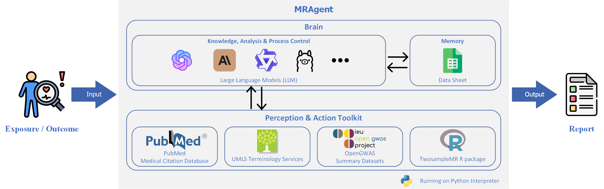
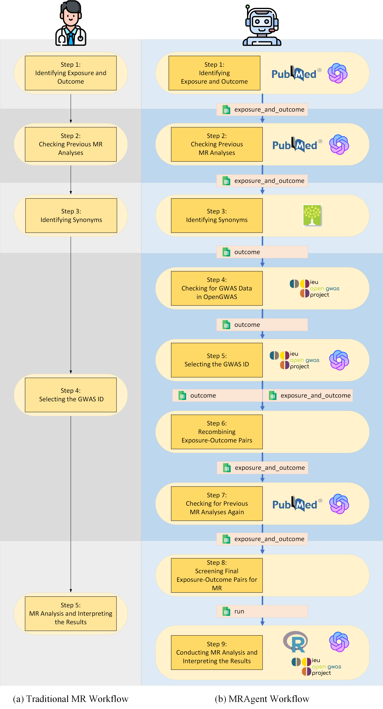

# MRAgent: An LLM-based Automated Agent for Causal Knowledge Discovery in Disease via Mendelian Randomization
[Paper](https://doi.org/10.1093/bib/bbaf140) | [GitHub](https://github.com/xuwei1997/MRAgent) | [PyPI](https://pypi.org/project/mragent/) | [Zenodo](https://doi.org/10.5281/zenodo.14184396) | [Web Demo](https://huggingface.co/spaces/xuwei1997/MRAgent) | [中文文档](https://p1bvxbwjxl0.feishu.cn/docx/L0ogdoDs5ofjIux6W6gct8E4nyd?from=from_copylink)

## Overview

Understanding causality in medical research is essential for developing effective interventions and diagnostic tools.
Mendelian Randomization (MR) is a pivotal method for inferring causality through genetic data. However, MR analysis
often requires pre-identification of exposure-outcome pairs from clinical experience or literature, which can be
challenging to obtain. This poses difficulties for clinicians investigating causal factors of specific diseases. To
address this, we introduce MRAgent, an innovative automated agent leveraging Large Language Models (LLMs) to enhance
causal knowledge discovery in disease research. MRAgent autonomously scans scientific literature, discovers potential
exposure-outcome pairs, and performs MR causal inference using extensive Genome-Wide Association Study (GWAS) data.

## MRAgent Architecture



## MRAgent Workflow

<div align="center">
	
</div>

## Installation

1. To install this package, please ensure you have `Python` version >3.9, which can be downloaded from
   the [standard distribution](https://www.python.org/) or
   the [Anaconda distribution](https://www.anaconda.com/download).
2. This package requires an R environment (version >4.3.4), which can be downloaded
   from [`R`](https://www.r-project.org/). You will also need to install the R
   packages: [`TwoSampleMR`](https://github.com/MRCIEU/TwoSampleMR/), [`ieugwasr`](https://github.com/MRCIEU/ieugwasr/), [`vcfR`](https://github.com/knausb/vcfR), [`MRlap`](https://github.com/n-mounier/MRlap),
   and [`jsonlite`](https://github.com/jeroen/jsonlite). While these packages can be automatically installed by the
   program, it is recommended to install them manually in advance, as the automatic installation may not always succeed.
3. Pip install this packages:

```shell
pip install mragent
```

## Preparation

### LLMs API Key

Before using MRAgent, you need to obtain the API Key for the LLMs, or run the LLM locally.
The following LLM APIs are currently supported:

- [OpenAI GPT](https://platform.openai.com/docs/overview)

MRAgent is also compatible with all models available on any platform that supports the OpenAI API, simply ensure that the **base_url** is correctly specified for use.

You can also run LLM locally, and we currently support all open source models running on ollama:

- [Ollama](https://markdown.com.cn)

You need to follow the steps to install ollama and follow the ollama python support package:

```shell
curl -fsSL https://ollama.com/install.sh | sh
pip install ollama
```

### GWAS token

You need to get the **GWAS token** for the OpenGWAS data.

- [OpenGWAS API](https://api.opengwas.io/)

## Usage

### "Knowledge Discovery" mode

In the Knowledge Discovery mode, upon inputting a specific disease, the MRAgent autonomously scans and analyzes relevant
literature from PubMed to identify potential exposures or outcomes associated with the disease. It then performs
Mendelian randomization analysis to ascertain causal relationships between the disease and the identified exposures or
outcomes, ultimately generating a comprehensive analysis report.

Run agent_workflow.py to start the MRAgent in the "Knowledge Discovery" mode:

#### Class

``` python
class MRAgent(self, mode='O', exposure=None, outcome=None, AI_key=None, model='MR', num=100, bidirectional=False,
                 synonyms=True, introduction=True, LLM_model='gpt-4o', gwas_token=None, opengwas_mode='csv', 
                 mr_quality_evaluation=False, mr_quality_evaluation_key_item=None, mrlap=False)

```

#### Parameters:

- mode: str, 'O' or 'E' optional (default='O')
    - The mode of the MRAgent. 'O' for "Knowledge Discovery" mode, the given disease is the outcome. 'E' for "Knowledge
      Discovery" mode, the given disease is the exposure.
- exposure: str, optional (default=None)
    - The exposure of the MRAgent. If mode is 'E', the exposure is the given disease.
- outcome: str, optional (default=None)
    - The outcome of the MRAgent. If mode is 'O', the outcome is the given disease.
- AI_key: str, optional (default=None)
    - The API key for the LLMs. Optional if running local LLM.
- model: str, 'MR' or 'MR_MOE', optional (default='MR')
    - MR methods in TwoSampleMR tool . 'MR' for the classical Mendelian randomization model. 'MR_MOE' for the Mendelian
      randomization model integrating a mixture-of-experts machine learning framework. If set to 'MR_MOE', you need to
      download the trained random forest model from [this link](https://www.dropbox.com/s/5la7y38od95swcf/rf.rdata?dl=0)
      to your working directory.
- num: int, optional (default=100)
    - The number of articles to be retrieved from PubMed.
- bidirectional: bool, optional (default=False)
    - Whether to perform bidirectional MR analysis.
- synonyms: bool, optional (default=True)
    - Whether to obtain synonyms for exposure and outcome.
- introduction: bool, optional (default=True)
    - Whether to print the introduction of the disease befor the MR.
- LLM_model: str, optional (default='gpt-4o')
    - The LLM model used in the MRAgent.
- model_type: str, 'openai' or 'ollama', optional (default='openai')
    - The model type of the LLM. 'openai' for using the openai api, 'ollama' for using a local model
- base_url: str, optional (default=None)
    - The base url for the OpenAI GPT model. Used for compatibility with third-party API platforms.
- gwas_token: str, optional (default=None)
    - The GWAS token for the OpenGWAS data.
- opengwas_model: str, 'csv' or 'online' optional (default='online')
    - The model of the OpenGWAS data. 'csv' for the local OpenGWAS data. 'online' for the online OpenGWAS data.
- mr_quality_evaluation: bool, optional (default=False)
    - Whether to evaluate the quality of the MR analysis using the STROBE-MR guidelines. For more information on
      STROBE-MR,
      please refer to the following link [strobe-mr.org](https://www.strobe-mr.org/).
- mr_quality_evaluation_key_item: list, optional (default=None)
    - The key items used to evaluate the quality of the MR analysis. If mr_quality_evaluation is True, you need to
      provide a list of key items for the STROBE-MR checklist. If any key item in the completed MR's STROBE-MR checklist
      is marked as No, the MR study is considered to be of low quality.
- mrlap: bool, optional (default=False)
    - Whether to use the MRlap R package to detect and correct for sample overlap. For more information, please refer
      to [MRlap GitHub repository](https://github.com/n-mounier/MRlap). If set to `TRUE`, you must download the
      supporting files `ld` and `hm3` from [this link](https://utexas.box.com/s/vkd36n197m8klbaio3yzoxsee6sxo11v) to
      your working directory.

#### Methods:

```python
run(self, step=None)
```

- step: list, optional (default=None)
    - The step of the MRAgent. If step is None, the MRAgent will run all steps. If step is a list, the MRAgent will run
      the steps in the list.

#### Example:

Mendelian randomisation analysis using MRAgent to investigate exposures and outcomes associated with back pain.

```python
from mragent import MRAgent
agent = MRAgent(outcome='back pain', model='MR', LLM_model='gpt-4o',
                AI_key='xxxx', gwas_token='xxxx', bidirectional=True,
                introduction=True, num=300)
agent.run(step=[1, 2, 3, 4, 5, 6, 7, 8, 9])
```

#### Output:
You can find the output in the `output` folder. Every time it runs, a folder named `Disease_Model` is generated under the `output` folder.

Inside this folder, you will find three data tables: `exposure_and_outcome`, which records paired exposure and outcome information, including study titles, previous MR analyses, and available GWAS data; `outcome`, which captures information on individual outcomes or exposures, including a complete list of GWAS IDs; and `run`, which records the final selected exposure and outcome pairs used for MR analysis. MRAgent can be run step-by-step, and you can manually adjust these three tables at any point to control the workflow.

In the subfolders of `Disease_Model`, you can view various MR results along with their corresponding reports. These subfolders contain detailed outputs for each analysis, including statistical results, plots, and other relevant documentation for interpretation.

### "Causal Validation" mode

In the Causal Validation mode, users can directly input a pair of exposure and outcome, and the MRAgent independently
carries out all steps of the Mendelian randomization study, providing a convenient and efficient report.

Run agent_workflow_OE.py to start the MRAgent in the "Causal Validation" mode:

#### Class

``` python
class MRAgentOE(self, mode='OE', exposure=None, outcome=None, AI_key=None, model='MR', bidirectional=False,
                 synonyms=True, introduction=True, LLM_model='gpt-4o', gwas_token=None, opengwas_mode='csv', 
                 mr_quality_evaluation=False, mr_quality_evaluation_key_item=None, mrlap=False)
```

#### Parameters:

- mode: str, 'OE', optional (default='OE')
    - The mode of the MRAgent. 'OE' for "Causal Validation" mode.
- exposure: str, optional (default=None)
    - The exposure of the MRAgent.
- outcome: str, optional (default=None)
    - The outcome of the MRAgent.
- AI_key: str, optional (default=None)
    - The API key for the LLMs. Optional if running local LLM.
- model: str, 'MR' or 'MR_MOE', optional (default='MR')
    - MR methods in TwoSampleMR tool . 'MR' for the classical Mendelian randomization model. 'MR_MOE' for the Mendelian
      randomization model integrating a mixture-of-experts machine learning framework.
- num: int, optional (default=100)
    - The number of articles to be retrieved from PubMed.
- bidirectional: bool, optional (default=False)
    - Whether to perform bidirectional MR analysis.
- synonyms: bool, optional (default=True)
    - Whether to obtain synonyms for exposure and outcome.
- introduction: bool, optional (default=True)
    - Whether to print the introduction of the disease befor the MR.
- LLM_model: str, optional (default='gpt-4o')
    - The LLM model used in the MRAgent.
- model_type: str, 'openai' or 'ollama', optional (default='openai')
    - The model type of the LLM. 'openai' for using the openai api, 'ollama' for using a local model
- base_url: str, optional (default=None)
    - The base url for the OpenAI GPT model. Used for compatibility with third-party API platforms.
- gwas_token: str, optional (default=None)
    - The GWAS token for the OpenGWAS data.
- opengwas_model: str, 'csv' or 'online' optional (default='online')
    - The model of the OpenGWAS data. 'csv' for the local OpenGWAS data. 'online' for the online OpenGWAS data.
- mr_quality_evaluation: bool, optional (default=False)
    - Whether to evaluate the quality of the MR analysis using the STROBE-MR guidelines. For more information on
      STROBE-MR,
      please refer to the following link [strobe-mr.org](https://www.strobe-mr.org/).
- mr_quality_evaluation_key_item: list, optional (default=None)
    - The key items used to evaluate the quality of the MR analysis. If mr_quality_evaluation is True, you need to
      provide a list of key items for the STROBE-MR checklist. If any key item in the completed MR's STROBE-MR checklist
      is marked as No, the MR study is considered to be of low quality.
- mrlap: bool, optional (default=False)
    - Whether to use the MRlap R package to detect and correct for sample overlap. For more information, please refer
      to [MRlap GitHub repository](https://github.com/n-mounier/MRlap). If set to `TRUE`, you must download the
      supporting files `ld` and `hm3` from [this link](https://utexas.box.com/s/vkd36n197m8klbaio3yzoxsee6sxo11v) to
      your working directory.

#### Methods:

```python
run(self, step=None)
```

- step: list, optional (default=None)
    - The step of the MRAgent. If step is None, the MRAgent will run all steps. If step is a list, the MRAgent will run
      the steps in the list.

#### Example:

Example of using MRAgent to perform Mendelian randomization analysis on the causal relationship between 'osteoarthritis'
and 'back pain'

```python
from mragent import MRAgentOE
agent = MRAgentOE(exposure='osteoarthritis', outcome='back pain',
                  AI_key='', LLM_model='gpt-4o',
                  model='MR', synonyms=False, bidirectional=True, introduction=False, gwas_token=mr_key)
agent.run(step=[1, 2, 3, 4, 5, 6, 7, 8, 9])
```

#### Output:
You can find the output in the `output` folder. Every time it runs, a folder named `Disease_Model` is generated under the `output` folder.

Inside this folder, you will find three data tables: `exposure_and_outcome`, where the exposure and outcome pairs are provided during initialization; `outcome`, which captures information on individual outcomes or exposures, including a complete list of GWAS IDs; and `run`, which records the final selected exposure and outcome pairs used for MR analysis. MRAgent can be run step-by-step, and you can manually adjust these three tables at any point to control the workflow.

In the subfolders of `Disease_Model`, you can view various MR results along with their corresponding reports. These subfolders contain detailed outputs for each analysis, including statistical results, plots, and other relevant documentation for interpretation.


## Experiments

1. step_1_test_out.py: Outputs the results for Identifying the Exposure and Outcome.
2. step_1_test_SimCSE.py: Calculates the similarity between the exposure-outcome pairs extracted by the LLM and those extracted by humans using SimCSE.
3. step_2_test.py: Evaluation of Checking Previous MR Analyses, assessing the consistency and relevance of previous Mendelian Randomization analyses.
4. step_2_test_STROBE_MR.py: Tests the evaluation of completed MR analyses using the STROBE-MR checklist.
5. step_5_test.py: Evaluation of Selecting Relevant GWAS, ensuring that the most appropriate Genome-Wide Association Studies are selected for analysis.
6. step_9_test_out.py: Interpreting the MR Results outputs by LLM.
7. step_9_test_SimCSE.py: Calculating the similarity between the report generated by the LLM and a reference report written by humans using SimCSE.

The source files generated by the test code have been uploaded to Zenodo and can be accessed at [https://doi.org/10.5281/zenodo.14184396](https://doi.org/10.5281/zenodo.14184396).
## Citation

> Wei Xu, Gang Luo, Weiyu Meng, Xiaobing Zhai, Keli Zheng, Ji Wu, Yanrong Li, Abao Xing, Junrong Li, Zhifan Li, Ke Zheng, Kefeng Li, MRAgent: an LLM-based automated agent for causal knowledge discovery in disease via Mendelian randomization, Briefings in Bioinformatics, Volume 26, Issue 2, March 2025, bbaf140, https://doi.org/10.1093/bib/bbaf140

# License

[Apache License 2.0](./LICENSE)

## Other

> Some icons in the schematic are from Flaticon.
>
> <a href="https://www.flaticon.com/" title="robot icons">Flaticon</a>