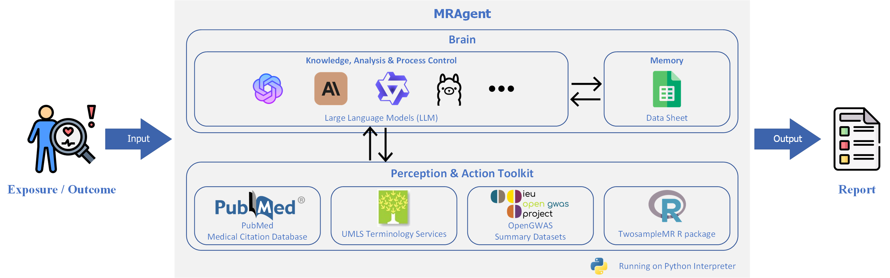

# MRAgent: LLM-based Automatic Two-sample Mendelian Randomization Agent

## Abstract

Mendelian randomization (MR) is a powerful analytical method that uses genetic variation to infer causal relationships
between modifiable exposures and health outcomes. Despite the availability of standardized MR analysis pipelines, such
as the TwoSampleMR R package, the process still requires significant intellectual input from professionals, including
tasks such as Genome-Wide Association Study (GWAS) data selection, script writing, and result interpretation. With the
advent of Large Language Models (LLMs) demonstrating human-level intelligence, LLM-based agents have shown potential in
perceiving external information and executing actions, inspiring the development of automated MR analysis tools. Here,
we propose the LLM-based automatic Mendelian randomization agent (MRAgent). MRAgent provides an automated analysis
pipeline, replacing the manual components of traditional MR analysis. It autonomously scans and analyzes relevant
literature, identifies potential exposures or outcomes related to diseases, and performs MR analysis to determine causal
relationships, generating comprehensive reports. We designed experiments for automatic evaluation and human evaluation
to compare the performance of different LLMs in operating MRAgent. Additionally, we provide a proof-of-concept case
demonstrating the complete workflow. MRAgent offers clinicians and researchers a rapid and reliable tool for exploring
and validating the causal factors associated with diseases, significantly reducing the time and expertise required for
MR studies.

## MRAgent Architecture



## MRAgent Workflow

<div align="center">
	
</div>

## Preparation

### LLMs API Key

Before using MRAgent, you need to obtain the API Key for the LLMs, or run the LLM locally.
The following LLM APIs are currently supported:

- [OpenAI GPT](https://platform.openai.com/docs/overview)
- [Google Gemini](https://ai.google.dev/#gemini-api)
- [Anthropic Claude](https://www.anthropic.com/claude)
- [Aliyun Qwen](https://help.aliyun.com/zh/dashscope/developer-reference/api-details?disableWebsiteRedirect=true)

You can also run LLM locally, and we currently support all open source models running on ollama:

- [Ollama](https://markdown.com.cn)

You need to follow the steps to install ollama and follow the ollama python support package:

```shell
curl -fsSL https://ollama.com/install.sh | sh
pip install ollama
```

### GWAS token

You need to get the **GWAS token** for the OpenGWAS data.

- [OpenGWAS API](https://api.opengwas.io/)

## Usage

### "Knowledge Discovery" mode

In the Knowledge Discovery mode, upon inputting a specific disease, the MRAgent autonomously scans and analyzes relevant
literature from PubMed to identify potential exposures or outcomes associated with the disease. It then performs
Mendelian randomization analysis to ascertain causal relationships between the disease and the identified exposures or
outcomes, ultimately generating a comprehensive analysis report.

Run agent_workflow.py to start the MRAgent in the "Knowledge Discovery" mode:

#### Class

``` python
class MRAgent(self, mode='O', exposure=None, outcome=None, AI_key=None, model='MR', num=100, bidirectional=False,
                 synonyms=True, introduction=True, LLM_model='gpt-4o', gwas_token=None)

```

#### Parameters:

- mode: str, 'O' or 'E' optional (default='O')
    - The mode of the MRAgent. 'O' for "Knowledge Discovery" mode, the given disease is the outcome. 'E' for "Knowledge
      Discovery" mode, the given disease is the exposure.
- exposure: str, optional (default=None)
    - The exposure of the MRAgent. If mode is 'E', the exposure is the given disease.
- outcome: str, optional (default=None)
    - The outcome of the MRAgent. If mode is 'O', the outcome is the given disease.
- AI_key: str, optional (default=None)
    - The API key for the LLMs. Optional if running local LLM.
- model: str, 'MR' or 'MR_MOE', optional (default='MR')
    - MR methods in TwoSampleMR tool . 'MR' for the classical Mendelian randomization model. 'MR_MOE' for the Mendelian
      randomization model integrating a mixture-of-experts machine learning framework.
- num: int, optional (default=100)
    - The number of articles to be retrieved from PubMed.
- bidirectional: bool, optional (default=False)
    - Whether to perform bidirectional MR analysis.
- synonyms: bool, optional (default=True)
    - Whether to obtain synonyms for exposure and outcome.
- introduction: bool, optional (default=True)
    - Whether to print the introduction of the disease befor the MR.
- LLM_model: str, optional (default='gpt-4o')
    - The LLM model used in the MRAgent.
- gwas_token: str, optional (default=None)
    - The GWAS token for the OpenGWAS data.

#### Methods:

```python
run(self, step=None)
```

- step: list, optional (default=None)
    - The step of the MRAgent. If step is None, the MRAgent will run all steps. If step is a list, the MRAgent will run
      the steps in the list.

#### Example:

Mendelian randomisation analysis using MRAgent to investigate exposures and outcomes associated with back pain.

```python
agent = MRAgent(outcome='back pain', model='MR', LLM_model='gpt-4o',
                AI_key='xxxx', gwas_token='xxxx', bidirectional=True,
                introduction=True, num=300)
agent.run(step=[1, 2, 3, 4, 5, 6, 7, 8, 9])
```

### "Causal Validation" mode

In the Causal Validation mode, users can directly input a pair of exposure and outcome, and the MRAgent independently
carries out all steps of the Mendelian randomization study, providing a convenient and efficient report.

Run agent_workflow_OE.py to start the MRAgent in the "Causal Validation" mode:

#### Class

``` python
class MRAgentOE(self, mode='OE', exposure=None, outcome=None, AI_key=None, model='MR', bidirectional=False,
                 synonyms=True, introduction=True, LLM_model='gpt-4o', gwas_token=None)
```

#### Parameters:

- mode: str, 'OE', optional (default='OE')
    - The mode of the MRAgent. 'OE' for "Causal Validation" mode.
- exposure: str, optional (default=None)
    - The exposure of the MRAgent.
- outcome: str, optional (default=None)
    - The outcome of the MRAgent.
- AI_key: str, optional (default=None)
    - The API key for the LLMs. Optional if running local LLM.
- model: str, 'MR' or 'MR_MOE', optional (default='MR')
    - MR methods in TwoSampleMR tool . 'MR' for the classical Mendelian randomization model. 'MR_MOE' for the Mendelian
      randomization model integrating a mixture-of-experts machine learning framework.
- num: int, optional (default=100)
    - The number of articles to be retrieved from PubMed.
- bidirectional: bool, optional (default=False)
    - Whether to perform bidirectional MR analysis.
- synonyms: bool, optional (default=True)
    - Whether to obtain synonyms for exposure and outcome.
- introduction: bool, optional (default=True)
    - Whether to print the introduction of the disease befor the MR.
- LLM_model: str, optional (default='gpt-4o')
    - The LLM model used in the MRAgent.
- gwas_token: str, optional (default=None)
    - The GWAS token for the OpenGWAS data.

#### Methods:

```python
run(self, step=None)
```

- step: list, optional (default=None)
    - The step of the MRAgent. If step is None, the MRAgent will run all steps. If step is a list, the MRAgent will run
      the steps in the list.

#### Example:

Example of using MRAgent to perform Mendelian randomization analysis on the causal relationship between 'osteoarthritis'
and 'back pain'

```python
agent = MRAgentOE(exposure='osteoarthritis', outcome='back pain',
                  AI_key='', LLM_model='gpt-4o',
                  model='MR', synonyms=False, bidirectional=True, introduction=False, gwas_token=mr_key)
agent.run(step=[1, 2, 3, 4, 5, 6, 7, 8, 9])
```

## Experiments
1. step_1_test_out.py
2. step_1_test_SimCSE.py
3. step_2_test.py
4. step_3_test.py
5. step_5_test.py
6. step_9_test_out.py
7. step_9_test_SimCSE.py

> TODO

## Citation

> TODO

# License

Apache License 2.0

## Other

> Some icons in the schematic are from Flaticon.
>
> <a href="https://www.flaticon.com/" title="robot icons">Flaticon</a>